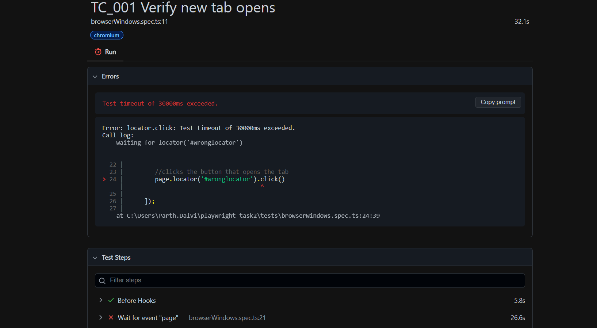
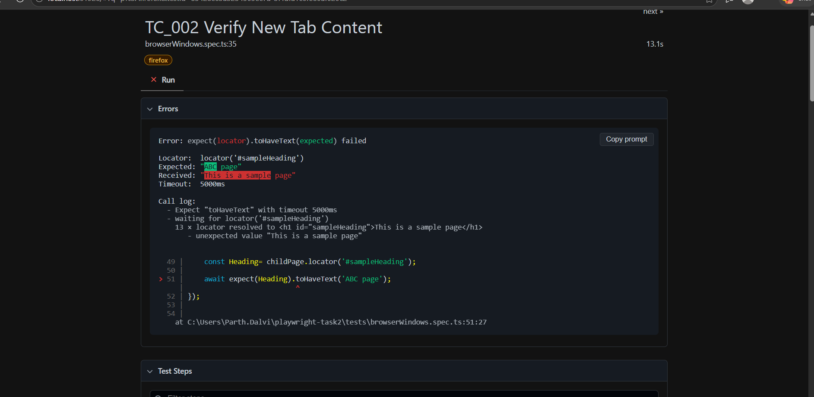
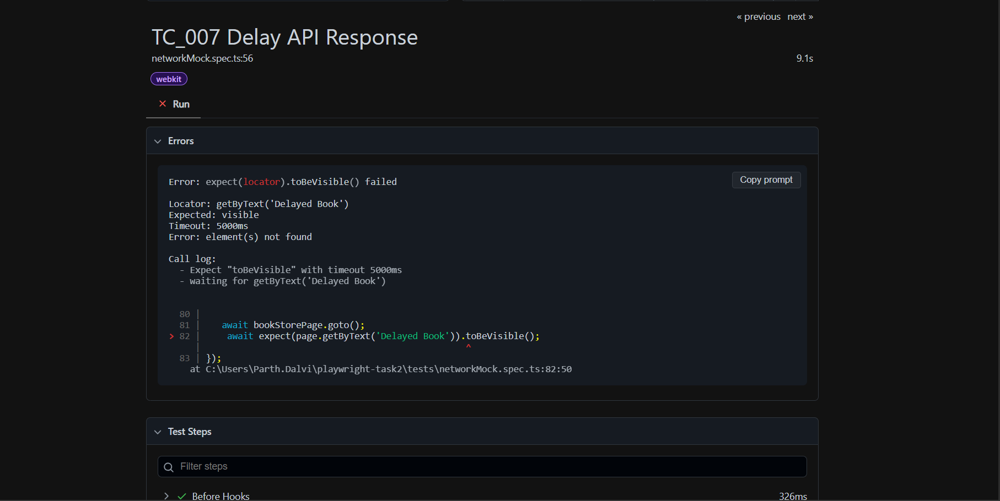
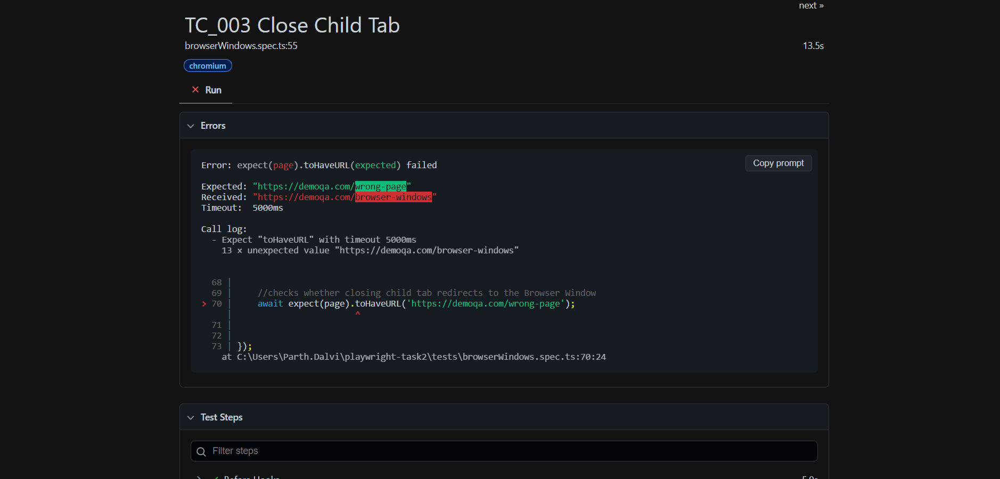
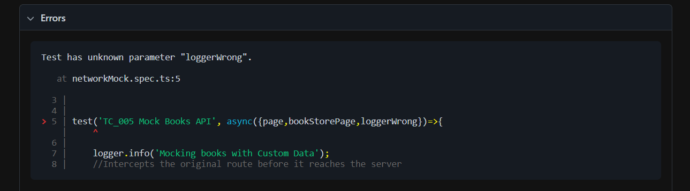
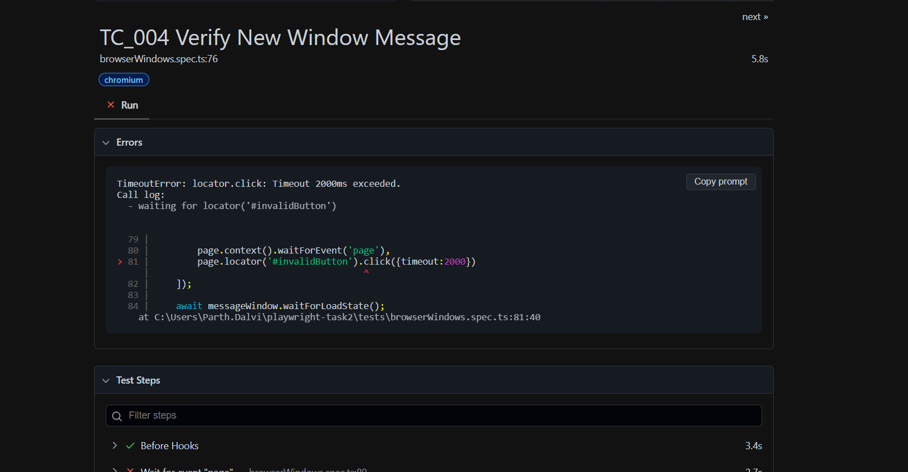
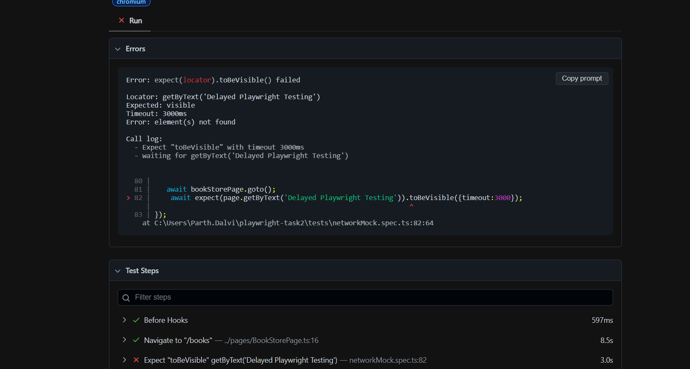
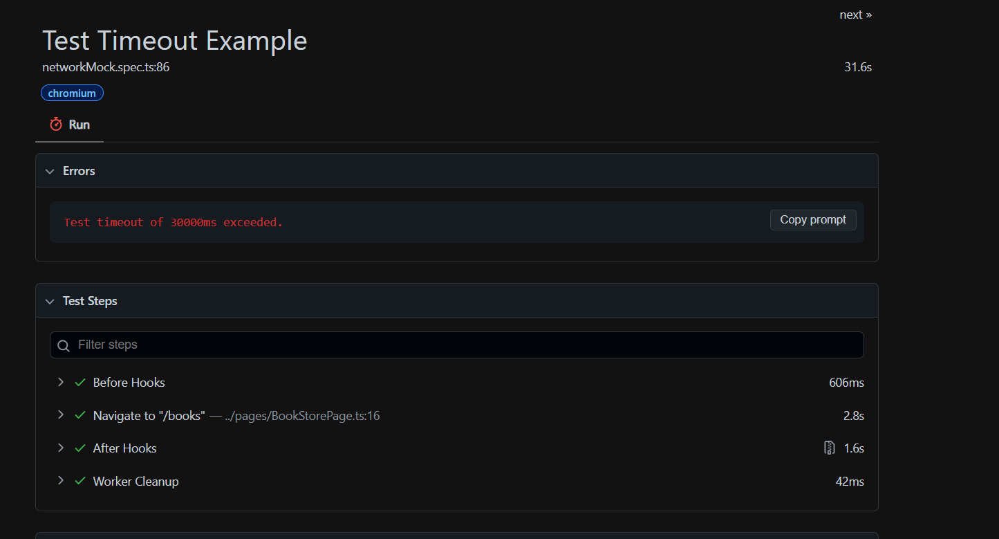

# Debugging Report

# Failure Categories 

## Failure Category 1 : Locator Failure

 ### Steps used to simulate 
 - Used an invalid locator which does not exist 
     #wronglocator
 
 ### Root Cause 
 - Locator is incorrect.
 - Element not found in DOM.

 ### Failure Log
  
    Error: locator.click: Test timeout of 30000ms exceeded.
    Call log:
    - waiting for locator('#wronglocator')

    22 |
    23 |         //clicks the button that opens the tab
    > 24 |         page.locator('#wronglocator').click()
        |                                       ^
    25 |
    26 |      ]);
    27 |

  

## Failure Category 2: Assertion Failure

 ### Steps used to Simulate
 1. Replaced Expected text 'This is a sample page' in TC_002 with 'ABC page'
 2. Executed Browser Window Tests
 3. Observed Assertion Failure

 ### Root Cause
 Incorrect expected value.Test Data mismatch.

 ### Failure Log

    Error: expect(locator).toHaveText(expected) failed

    Locator:  locator('#sampleHeading')
    Expected: "ABC page"
    Received: "This is a sample page"
    Timeout:  5000ms

    Call log:
    - Expect "toHaveText" with timeout 5000ms
    - waiting for locator('#sampleHeading')
        13 × locator resolved to <h1 id="sampleHeading">This is a sample page</h1>
        - unexpected value "This is a sample page"

    49 |     const Heading= childPage.locator('#sampleHeading');
    50 |
    > 51 |     await expect(Heading).toHaveText('ABC page');
        |                           ^
    52 | });
    53 |
    54 |

   
    
## Failure Category 3: Synchronization / Timing Failure

 ### Steps used to simulate
 1. Increased mock API response delay to 10 seconds
 2. Reduced assertion timeout to 2 seconds
 3. Executed TC_007
 4. Observed Synchronization Failure

 ### Root Cause

 Application response was delayed but, assertion timeout was shorter than response time.

 ### Failure Log

    Error: expect(locator).toBeVisible() failed

    Locator: getByText('Delayed Book')
    Expected: visible
    Timeout: 5000ms
    Error: element(s) not found

    Call log:
    - Expect "toBeVisible" with timeout 5000ms
    - waiting for getByText('Delayed Book')

    80 |        
    81 |    await bookStorePage.goto();
    > 82 |     await expect(page.getByText('Delayed Book')).toBeVisible();
        |                                                  ^
    83 | });
        at C:\Users\Parth.Dalvi\playwright-task2\tests\networkMock.spec.ts:82:50
    

## Failure Category 4 : URL Assertion Failure

  ### Steps Used to Simulate
  1. Modified assertion from '/browser-windows/' to '/wrong-page/'
  2. Executed the Browser Window Tests
  3. Observed Assertion Failure

  ### Root Cause
    
  Expected URL pattern did not match the actual page URL

  ### Failure Log

    Error: expect(page).toHaveURL(expected) failed

    Expected: "https://demoqa.com/wrong-page"
    Received: "https://demoqa.com/browser-windows"
    Timeout:  5000ms

    Call log:
    - Expect "toHaveURL" with timeout 5000ms
        13 × unexpected value "https://demoqa.com/browser-windows"

    68 |    
    69 |     //checks whether closing child tab redirects to the Browser Window
    > 70 |     await expect(page).toHaveURL('https://demoqa.com/wrong-page');
        |                        ^
    71 |
    72 |
    73 | });

  

## Failure Category 5: Fixture Misconfiguration Failure

  ### Steps Used to Simulate
  1. Renamed the fixture parameter from 'logger' to 'loggerWrong'
  2. Executed the test suite
  3. Observed Fixture Resolution Failure

  ### Root Cause 
  Test attempted to use a fixture that was not defined in customFixtures.ts 

  ### Failure Log

    Test has unknown parameter "loggerWrong".

    at networkMock.spec.ts:5

    3 |
    4 |
    > 5 | test('TC_005 Mock Books API', async({page,bookStorePage,loggerWrong})=>{
        |     ^
    6 |      
    7 |     logger.info('Mocking books with Custom Data');
    8 |     //Intercepts the original route before it reaches the server

  

# Timeout Types

# Type 1 : Action Timeout

  # Description
  A user action(click,fill,etc) takes too long

  # Steps Used to Simulate
  1. Replaced '#messageWindowButton' with an invalid locator '#invalidButton'
  2. Attempt click action
  3. Set action timeout to 2 seconds
  4. Playwright searches for the element,but element is not found.
  5. Action Timeout occurs

  # Root Cause

  Target element was not found before action timeout occured

  # Failure Log

    TimeoutError: locator.click: Timeout 2000ms exceeded.
    Call log:
    - waiting for locator('#invalidButton')

    79 |
    80 |         page.context().waitForEvent('page'),
    > 81 |         page.locator('#invalidButton').click({timeout:2000})
        |                                        ^
    82 |     ]);
    83 |
    84 |     await messageWindow.waitForLoadState();
        at C:\Users\Parth.Dalvi\playwright-task2\tests\browserWindows.spec.ts:81:40
 
 

# Type 2: Expect Timeout

  # Description 
  Assertion condition is not satisfied within the specified framework

  # Steps Used to Simulate
  1. Kept mocked API response as 'Delayed Book' in TC_007
  2. Modified assertion to search for text 'Delayed Playwright Testing' (text does not exists)
  3. Apply assertion timeout of 3 seconds
  4. Playwright repeatedly checks for the element, but the element never appears
  5. Assertion timeout occurs

  # Root Cause

  Expected condition was not satified within the timeout period 

  # Failure Log

    Error: expect(locator).toBeVisible() failed

    Locator: getByText('Delayed Playwright Testing')
    Expected: visible
    Timeout: 3000ms
    Error: element(s) not found

    Call log:
    - Expect "toBeVisible" with timeout 3000ms
    - waiting for getByText('Delayed Playwright Testing')

    80 |        
    81 |    await bookStorePage.goto();
    > 82 |     await expect(page.getByText('Delayed Playwright Testing')).toBeVisible({timeout:3000});
        |                                                                ^
    83 | });

    

# Type 3 : Test Timeout

  # Description
  Entire test exceeds the maximum execution time

  # Steps Used to Simulate
  1. Introduced a delay of 35 seconds using setTimeout()
  2. Executed the test 
  3. Playwright waits for the delay to finish, but Default test timeout of 30 seconds is exceeded
  4. Test Execution is terminated

  # Root Cause

  Total test execution time exceeded the Playwright test timeout

  # Failure Log

   Test timeout of 30000ms exceeded.

   